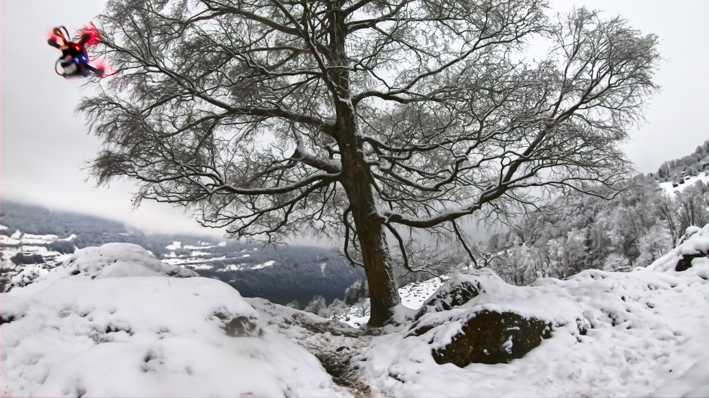
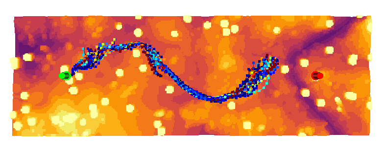

# Learning High-Speed Flight in the Wild

This repo contains the code associated with the paper Learning Agile Flight in the Wild.
For more information, please check the [project webpage](http://rpg.ifi.uzh.ch/AgileAutonomy.html).



#### Paper, Video, and Datasets

If you use this code in an academic context, please cite the following publication:

Paper: [Learning High-Speed Flight in the Wild](http://rpg.ifi.uzh.ch/docs/Loquercio21_Science.pdf)

Video (Narrated): [YouTube](https://youtu.be/m89bNn6RFoQ)

Datasets: [Zenodo](https://zenodo.org/record/5517791#.YV2zkGNfhhE)

Science Paper: [DOI](https://www.science.org/doi/10.1126/scirobotics.abg5810)

```
@inproceedings{Loquercio2021Science,
  title={Learning High-Speed Flight in the Wild},
    author={Loquercio, Antonio and Kaufmann, Elia and Ranftl, Ren{\'e} and M{\"u}ller, Matthias and Koltun, Vladlen and Scaramuzza, Davide},
      booktitle={Science Robotics}, 
      year={2021}, 
      month={October}, 
} 
```

## Installation

### Requirements

The code was tested with Ubuntu 20.04, ROS Noetic, Anaconda v4.8.3., and `gcc/g++` 7.5.0.
Different OS and ROS versions are possible but not supported.

Before you start, make sure that your compiler versions match `gcc/g++` 7.5.0. To do so, use the following commands:

```
sudo update-alternatives --install /usr/bin/g++ g++ /usr/bin/g++-7 100
sudo update-alternatives --install /usr/bin/gcc gcc /usr/bin/gcc-7 100
```


### Step-by-Step Procedure

Use the following commands to create a new catkin workspace and a virtual environment with all the required dependencies.

```bash
export ROS_VERSION=noetic
mkdir agile_autonomy_ws
cd agile_autonomy_ws
export CATKIN_WS=./catkin_aa
mkdir -p $CATKIN_WS/src
cd $CATKIN_WS
catkin init
catkin config --extend /opt/ros/$ROS_VERSION
catkin config --merge-devel
catkin config --cmake-args -DCMAKE_BUILD_TYPE=Release -DCMAKE_CXX_FLAGS=-fdiagnostics-color
cd src

git clone git@github.com:uzh-rpg/agile_autonomy.git
vcs-import < agile_autonomy/dependencies.yaml
cd rpg_mpl_ros
git submodule update --init --recursive

#install extra dependencies (might need more depending on your OS)
sudo apt-get install libqglviewer-dev-qt5

# Install external libraries for rpg_flightmare
sudo apt install -y libzmqpp-dev libeigen3-dev libglfw3-dev libglm-dev

# Install dependencies for rpg_flightmare renderer
sudo apt install -y libvulkan1 vulkan-utils gdb

# Add environment variables (Careful! Modify path according to your local setup)
echo 'export RPGQ_PARAM_DIR=/home/<path/to/>catkin_aa/src/rpg_flightmare' >> ~/.bashrc
```

Now open a new terminal and type the following commands.

```bash
# Build and re-source the workspace
catkin build
. ../devel/setup.bash

# Create your learning environment
roscd planner_learning
conda create --name tf_24 python=3.7
conda activate tf_24
pip install tensorflow-gpu==2.4
pip install rospkg==1.2.3 pyquaternion open3d opencv-python
```

Now download the flightmare standalone available at [this link](https://zenodo.org/record/5517791/files/standalone.tar?download=1), extract it and put in the [flightrender](https://github.com/antonilo/flightmare_agile_autonomy/tree/main/flightrender) folder.


## Let's Fly!

Once you have installed the dependencies, you will be able to fly in simulation with our pre-trained checkpoint. You don't need necessarily need a GPU for execution. Note that if the network can't run at least at 15Hz, you won't be able to fly successfully.

Launch the simulation! Open a terminal and type:
```bash
cd agile_autonomy_ws
source catkin_aa/devel/setup.bash
roslaunch agile_autonomy simulation.launch
```

Run the Network in an other terminal:
```bash
cd agile_autonomy_ws
source catkin_aa/devel/setup.bash
conda activate tf_24
python test_trajectories.py --settings_file=config/test_settings.yaml

```


## Change execution speed or environment

You can change the average speed at which the policy will fly as well as the environment type by changing the following files.

Environment Change: 
```
rosed agile_autonomy flightmare.yaml
```
Set either the `spawn_trees` or `spawn_objects` to true. Doing both at the same time is possible but would make the environment too dense for navigation. Also adapt the `spacings` parameter in [test\_settings.yaml](planner_learning/config/test_settings.yaml) to the environment. 

Speed Change:
```
rosed agile_autonomy default.yaml
```
Edit the `test_time_velocity` and `maneuver_velocity` to the required speed. Note that the ckpt we provide will work for all speeds in the range `[1,10] m/s`. However, to reach the best performance at a specific speed, please consider finetuning the ckpt at the desired speed (see code below). 


## Train your own navigation policy

There are two ways in which you can train your own policy. One easy and one more involved.
The trained checkpoint can then be used to control a physical platform (if you have one!).

### Use pre-collected dataset

The first method, requiring the least effort, is to use a dataset that we pre-collected. The dataset can be found at [this link](https://zenodo.org/record/5517791/files/agile_autonomy_dataset.tar.xz?download=1). This dataset was used to train the model we provide and collected at an average speed of 7 m/s. To do this, adapt the file [train\_settings.yaml](planner_learning/config/train_settings.yaml) to point to the train and test folder and run:

```bash
cd agile_autonomy_ws
source catkin_aa/devel/setup.bash
conda activate tf_24
python train.py --settings_file=config/train_settings.yaml
```
Feel free to ablate the impact of each parameter!

### Collect your own dataset

You can use the following commands to generate data in simulation and train your model on it. Note that training a policy from scratch could require a lot of data, and depending on the speed of your machine this could take several days. Therefore, we always recommend finetuning the provided checkpoint to your use case. As a general rule of thumb, you need a dataset with comparable size to ours to train a policy from scratch, but only 1/10th of it to finetune.


### Generate data

To train or finetune a policy, use the following commands:
Launch the simulation in one terminal
```bash
cd agile_autonomy_ws
source catkin_aa/devel/setup.bash
roslaunch agile_autonomy simulation.launch
```

Launch data collection (with dagger) in an other terminal
```bash
cd agile_autonomy_ws
source catkin_aa/devel/setup.bash
conda activate tf_24
python dagger_training.py --settings_file=config/dagger_settings.yaml
```

It is possible to change parameters (number of rollouts, dagger constants, tracking a global trajectory, etc. ) in the file [dagger\_settings.yaml](planner_learning/config/dagger_settings.yaml). Keep in mind that if you change the network or input, you will need to adapt the file [test\_settings.yaml](planner_learning/config/test_settings.yaml) for compatibility.


When training from scratch, follow a pre-computed global trajectory to give consistent labels. To activate this, you need to put to true the flag `perform_global_planning` in [default.yaml](data_generation/agile_autonomy/parameters/default.yaml) and [label\_generation.yaml](data_generation/traj_sampler/parameters/label_generation.yaml). Note that this will make the simulation slower (a global plan has to be computed at each iteration). The network will not have access to this global plan, but only to the straight (possibly in collision) reference.


### Visualize the Data

You can visualize the generated trajectories in open3d using the [visualize\_trajectories.py](data_generation/viz_utils/visualize_trajectories.py) script.

```
python visualize_trajectories.py --data_dir /PATH/TO/rollout_21-09-21-xxxx --start_idx 0 --time_steps 100 --pc_cutoff_z 2.0 --max_traj_to_plot 100
```
The result should more or less look as the following:




### Test the Network

To test the network you trained, adapt the [test\_settings.yaml](planner_learning/config/test_settings.yaml) with the new checkpoint path. You might consider putting back the flag `perform_global_planning` in [default.yaml](data_generation/agile_autonomy/parameters/default.yaml) to false to make the simulation faster. Then follow the instructions in the above section (Let's Fly!) to test.


## Ackowledgements

We would like to thank Yunlong Song and Selim Naji for their help with the implementations of the simulation environment. The code for global planning is strongly inspired by the one of [Search-based Motion Planning for Aggressive Flight in SE(3)](https://github.com/sikang/mpl_ros).
